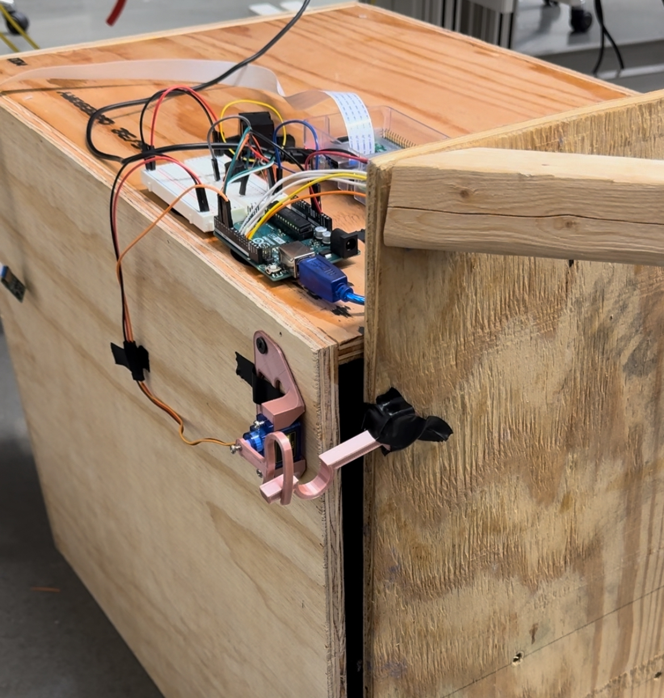

# Smart Home Mailbox
For my senior project, myself as well as two classmates are developing a smart mailbox system. To
open the mailbox, a user will be required to provide biometric authentication via a fingerprint
scan as well as a RFID scan.

I myself am responsible for all of the code in this project. My partners are responsible for 
building their own implementations of an RFID transceiver and power supply. I will not cover their
development on this page.

## My Setup
### Hardware
#### Computing
* 2018 MacBook Pro (Sonoma)
* Raspberry Pi 3 Model B (Raspbian GNU/Linux 9)
* Arduino Uno R3
#### Circuitry
* 1 LED
* Piezo Buzzer
* MFRC522 (RFID Read/Write)
* DIYmall Optical Fingerprint Reader Sensor Module
* Adafruit Medium Push-Pull Solenoid - 5V or 6V (NOTE: This is currently not functional. The
current provided by the arduino is not enough to power the solenoid. However, the code to operate
the solenoid is included in the project.)
#### Dev Tools
* Monitor for RPi GUI (this could also be done via vnc)
* Ethernet Crossover Cable (to establish LAN connection to RPi)
* External Network Interface Card
* USB 2.0 Cable Type A/B (for UART between RPi and Arduino)

### Packages
#### Arduino
* Adafruit Fingerprint Sensor Library
(https://github.com/adafruit/Adafruit-Fingerprint-Sensor-Library)
* RFID (https://github.com/miguelbalboa/rfid)
### Python
* pySerial (https://pyserial.readthedocs.io/en/latest/shortintro.html)
* picamera (https://picamera.readthedocs.io/en/release-1.13/)

## Wiring

## Usage
After installing the required Python packages on your RPi and the required Arduino packages on your
arduino, you can run the project using auth.sh.